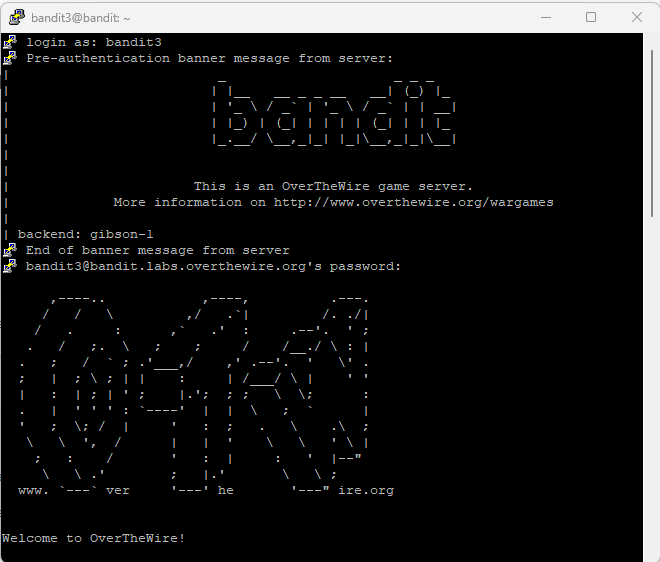
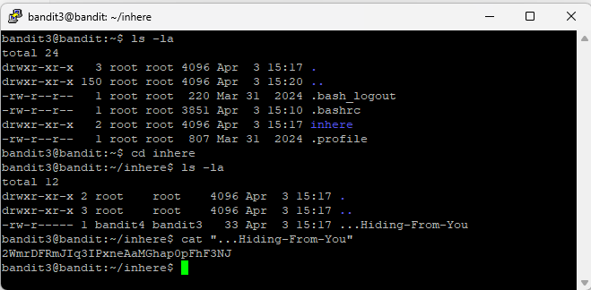

# Level 4

## Goal

Retrieve the password for Level 5 from the hidden file located inside the `inhere` directory.

---

## Access

The connection was established using SSH with the credentials obtained from Level 3.

For SSH setup instructions, refer to the [PuTTY Setup Guide](../Setup/PuTTY-Setup/README.md).

---

## Credentials

### Username

```text
bandit3
```

### Password

```text
MNk8KNH3Usiio41PRUEoDFPqfxLPlSmx
```

---

## Commands Used

### Command 1 — List Files and Directories Using `ls -la`

```bash
ls -la
```

Lists all files and directories, including hidden files, along with detailed file permissions and ownership information.

### Command 2 — Change Directory Using `cd`

```bash
cd inhere
```

Moves into the `inhere` directory.

### Command 3 — List Hidden Files Inside inhere Using `ls -la`

```bash
ls -la
```

Displays all files inside the directory, including hidden files.

### Command 4 — Read Hidden File Contents Using `cat`

```bash
cat "...Hiding-From-You"
```

Displays the contents of the hidden file.

---

## Explanation

The initial `ls -la` command was used to identify the `inhere` directory in the home directory.

The `cd inhere` command was used to move into the `inhere` directory.

A second `ls -la` command revealed the hidden file named `...Hiding-From-You`.

The `cat "...Hiding-From-You"` command displayed the contents of the hidden file, which contained the password required to access Level 5.

Hidden files in Linux typically begin with a dot (`.`) and are not shown with a normal `ls` command.

Using the `-a` option with `ls` displays hidden files and directories.

---

## Retrieved Password

```text
2WmrDFRmJIq3IPxneAaMGhap0pFhF3NJ
```

---

## Screenshots

### SSH Login



### Hidden File Discovery and Password Retrieval



---

## Key Learning

- Understanding hidden files in Linux
- Using `ls -la` to reveal hidden files
- Navigating directories using `cd`
- Reading hidden file contents using `cat`
