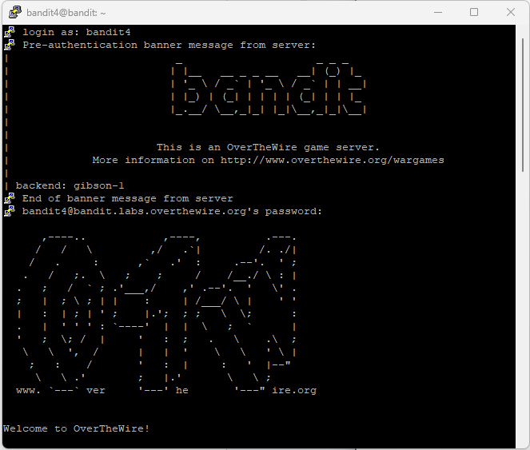
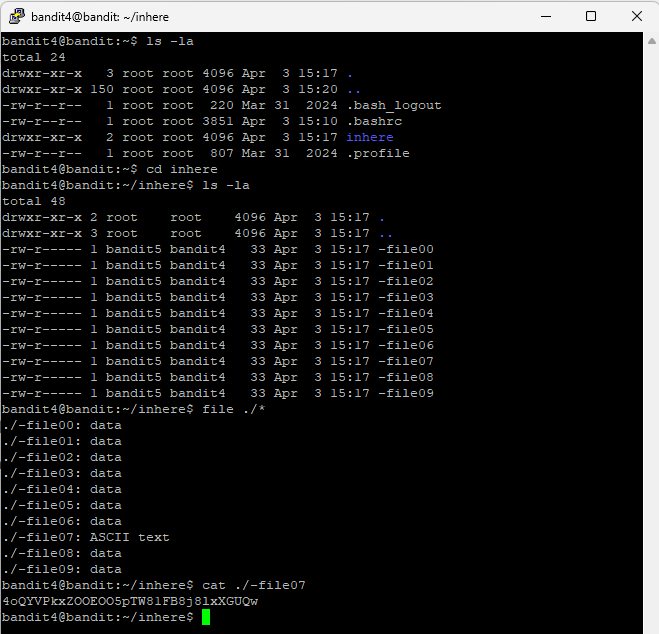

# Level 5

## Goal

Retrieve the password for Level 6 from the only human-readable file located in the `inhere` directory.

---

## Access

The connection was established using SSH with the credentials obtained from Level 4.

For SSH setup instructions, refer to the [PuTTY Setup Guide](../Setup/PuTTY-Setup/README.md).

---

## Credentials

### Username

```text
bandit4
```

### Password

```text
2WmrDFRmJIq3IPxneAaMGhap0pFhF3NJ
```

---

## Commands Used

### Command 1 — List Files and Directories Using `ls -la`

```bash
ls -la
```

Lists all files and directories, including hidden files, along with detailed file permissions and ownership information.

### Command 2 — Change Directory Using `cd`

```bash
cd inhere
```

Moves into the `inhere` directory.

### Command 3 — List Files Inside the Directory Using `ls -la`

```bash
ls -la
```

Displays all files present inside the `inhere` directory.

### Command 4 — Identify Human-Readable Files Using `file`

```bash
file ./*
```

Checks the file type of each file in the current directory.

### Command 5 — Read the Human-Readable File Using `cat`

```bash
cat ./-file07
```

Displays the contents of the human-readable file.

---

## Explanation

The initial `ls -la` command was used to identify the `inhere` directory.

The `cd inhere` command moved into the target directory.

A second `ls -la` command displayed all files inside the directory.

The `file ./*` command was used to identify the only human-readable file among multiple files.

Most files were identified as `data`, while `-file07` was identified as `ASCII text`, indicating it was human-readable.

The `cat ./-file07` command displayed the contents of the file and revealed the password for Level 6.

The `./` prefix was used because the filename begins with a dash (`-`), which Linux may interpret as a command option.

---

## Retrieved Password

```text
4oQYVPkxZOOEOO5pTW81FB8j8lxXGUQw
```

---

## Screenshots

### SSH Login



### Human-Readable File Discovery and Password Retrieval



---

## Key Learning

- Identifying human-readable files in Linux
- Using the `file` command to detect file types
- Handling filenames beginning with special characters
- Reading file contents using `cat`
