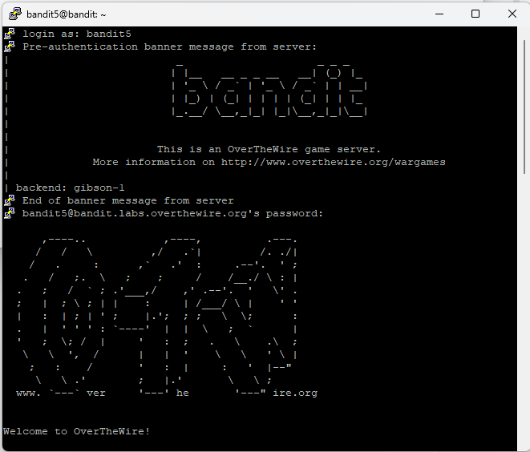
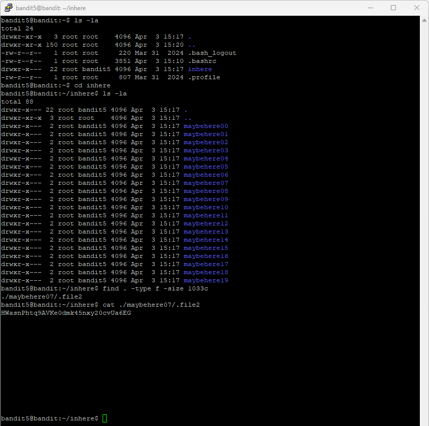

# Level 6

## Goal

Retrieve the password for Level 7 from a file located somewhere under the `inhere` directory with the following properties:

- Human-readable
- 1033 bytes in size
- Not executable

---

## Access

The connection was established using SSH with the credentials obtained from Level 5.

For SSH setup instructions, refer to the [PuTTY Setup Guide](../Setup/PuTTY-Setup/README.md).

---

## Credentials

### Username

```text
bandit5
```

### Password

```text
4oQYVPkxZOOEOO5pTW81FB8j8lxXGUQw
```

---

## Commands Used

### Command 1 — List Files and Directories Using `ls -la`

```bash
ls -la
```

Lists all files and directories, including hidden files, along with detailed file permissions and ownership information.

### Command 2 — Change Directory Using `cd`

```bash
cd inhere
```

Moves into the `inhere` directory.

### Command 3 — List Files Inside the Directory Using `ls -la`

```bash
ls -la
```

Displays all files and directories inside the `inhere` directory.

### Command 4 — Find the Required File Using `find`

```bash
find . -type f -size 1033c
```

Searches for files that are exactly 1033 bytes in size.

### Command 5 — Read the File Contents Using `cat`

```bash
cat ./maybehere07/.file2
```

Displays the contents of the identified file and reveals the password for Level 7.

---

## Explanation

The initial `ls -la` command was used to identify the `inhere` directory.

The `cd inhere` command moved into the target directory.

A second `ls -la` command displayed multiple subdirectories located inside `inhere`.

The `find . -type f -size 1033c` command searched recursively for files matching the required size of 1033 bytes.

- `.` specifies the current directory
- `-type f` limits the search to files only
- `-size 1033c` searches for files exactly 1033 bytes in size

The command returned the file: `./maybehere07/.file2`

The `cat ./maybehere07/.file2` command displayed the contents of the file and revealed the password for Level 7.

---

## Retrieved Password

```text
HWasnPhtq9AVKe0dmk45nxy20cvUa6EG
```

---

## Screenshots

### SSH Login



### File Discovery and Password Retrieval



---

## Key Learning

- Using the `find` command to search for files
- Filtering files by size and type in Linux
- Navigating nested directories
- Reading hidden files in Linux
- Understanding recursive file searching
