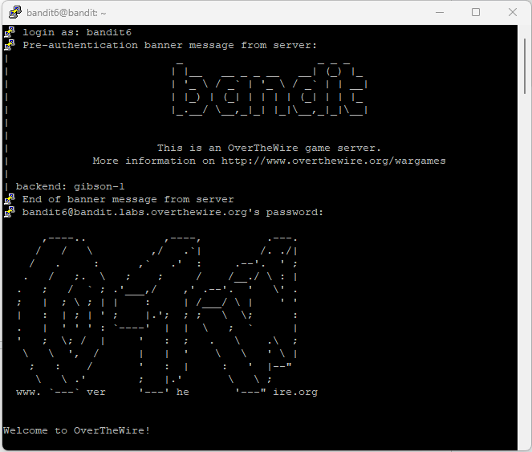
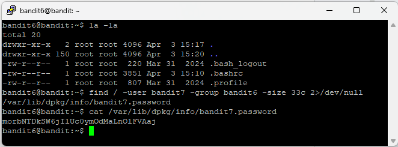

# Level 7

## Goal

Retrieve the password for Level 8 from a file located somewhere on the server with the following properties:

- Owned by user `bandit7`
- Owned by group `bandit6`
- 33 bytes in size

---

## Access

The connection was established using SSH with the credentials obtained from Level 6.

For SSH setup instructions, refer to the [PuTTY Setup Guide](../Setup/PuTTY-Setup/README.md).

---

## Credentials

### Username

```text
bandit6
```

### Password

```text
HWasnPhtq9AVKe0dmk45nxy20cvUa6EG
```

---

## Commands Used

### Command 1 — List Files and Directories Using `ls -la`

```bash
ls -la
```

Lists all files and directories, including hidden files, along with detailed file permissions and ownership information.

### Command 2 — Find the Required File Using `find`

```bash
find / -type f -user bandit7 -group bandit6 -size 33c 2>/dev/null
```

Searches the entire system for files matching the required owner, group, and size.

### Command 3 — Read the File Contents Using `cat`

```bash
cat /var/lib/dpkg/info/bandit7.password
```

Displays the contents of the identified file and reveals the password for Level 8.

---

## Explanation

The `ls -la` command was used to display the contents of the current directory.

The `find` command searched the entire filesystem for a file matching all required conditions.

- `/` starts the search from the root directory
- `-type f` limits the search to files only
- `-user bandit7` searches for files owned by user `bandit7`
- `-group bandit6` searches for files owned by group `bandit6`
- `-size 33c` searches for files exactly 33 bytes in size
- `2>/dev/null` suppresses permission denied error messages

The command returned the following file: `/var/lib/dpkg/info/bandit7.password`

The `cat` command displayed the contents of the file and revealed the password for Level 8.

---

## Retrieved Password

```text
morbNTDkSW6jIlUc0ymOdMaLnOlFVAaj
```

---

## Screenshots

### SSH Login



### File Discovery and Password Retrieval



---

## Key Learning

- Using advanced options with the `find` command
- Searching files by owner, group, and size
- Searching across the entire filesystem in Linux
- Suppressing error messages using `2>/dev/null`
- Reading protected files using Linux commands
