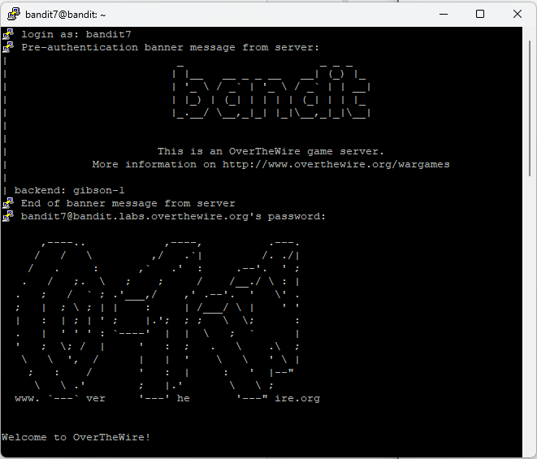
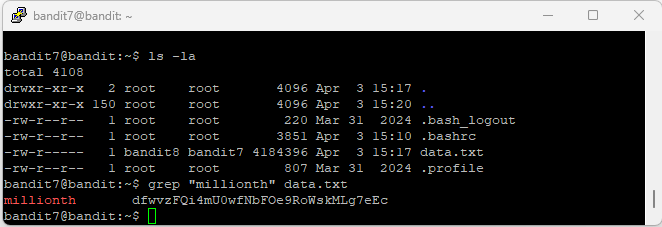

# Level 8

## Goal

Retrieve the password for Level 9 from the file `data.txt` next to the word `millionth`.

---

## Access

The connection was established using SSH with the credentials obtained from Level 7.

For SSH setup instructions, refer to the [PuTTY Setup Guide](../Setup/PuTTY-Setup/README.md).

---

## Credentials

### Username

```text
bandit7
```

### Password

```text
morbNTDkSW6jIlUc0ymOdMaLnOlFVAaj
```

---

## Commands Used

### Command 1 — List Files and Directories Using `ls -la`

```bash
ls -la
```

Lists all files and directories, including hidden files, along with detailed file permissions and ownership information.

### Command 2 — Search for the Word Using `grep`

```bash
grep millionth data.txt
```

Searches the file `data.txt` for the word `millionth`.

---

## Explanation

The `ls -la` command was used to identify the `data.txt` file in the home directory.

The `grep millionth data.txt` command searched the contents of `data.txt` for the word `millionth`.

- `grep` is used to search text patterns inside files
- `millionth` is the keyword being searched
- `data.txt` is the target file

The command returned the line containing the word `millionth` along with the password for Level 9.

---

## Retrieved Password

```text
dfwvzFQi4mU0wfNbFOe9RoWskMLg7eEc
```

---

## Screenshots

### SSH Login



### Password Retrieval Using `grep`



---

## Key Learning

- Using the `grep` command to search text inside files
- Searching for specific keywords in Linux
- Working with large text files
- Understanding basic text processing commands
