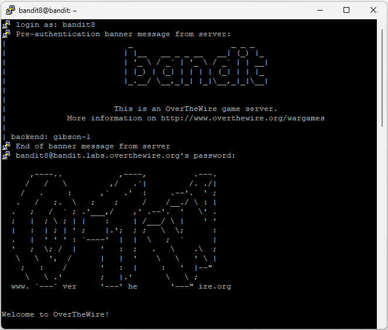
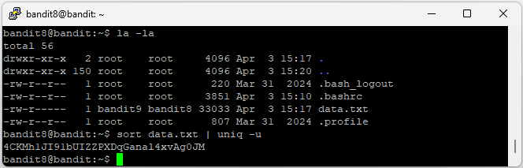

# Level 9

## Goal

Retrieve the password for Level 10 from the file `data.txt`, where the password is the only line that occurs exactly once.

---

## Access

The connection was established using SSH with the credentials obtained from Level 8.

For SSH setup instructions, refer to the [PuTTY Setup Guide](../Setup/PuTTY-Setup/README.md).

---

## Credentials

### Username

```text
bandit8
```

### Password

```text
dfwvzFQi4mU0wfNbFOe9RoWskMLg7eEc
```

---

## Commands Used

### Command 1 — List Files and Directories Using `ls -la`

```bash
ls -la
```

Lists all files and directories, including hidden files, along with detailed file permissions and ownership information.

### Command 2 — Find the Unique Line Using `sort` and `uniq`

```bash
sort data.txt | uniq -u
```

Sorts the contents of `data.txt` and displays only the line that appears exactly once.

---

## Explanation

The `ls -la` command was used to identify the `data.txt` file in the home directory.

The `sort data.txt | uniq -u` command was used to locate the only line that appears exactly once in the file.

- `sort data.txt` sorts all lines alphabetically
- `|` passes the output of one command to another command
- `uniq -u` displays only lines that occur exactly once

The command returned the following line:

`4CKMh1JI91bUIZZPXDqGanal4xvAg0JM`

The `sort` command organized the contents of the file, and the `uniq` command identified the only line that appeared once, revealing the password for Level 10.

---

## Retrieved Password

```text
4CKMh1JI91bUIZZPXDqGanal4xvAg0JM
```

---

## Screenshots

### SSH Login



### Unique Line Discovery and Password Retrieval



---

## Key Learning

- Using pipes (`|`) in Linux
- Combining commands for text processing
- Sorting text using `sort`
- Finding unique lines using `uniq`
- Working with large text files in Linux
