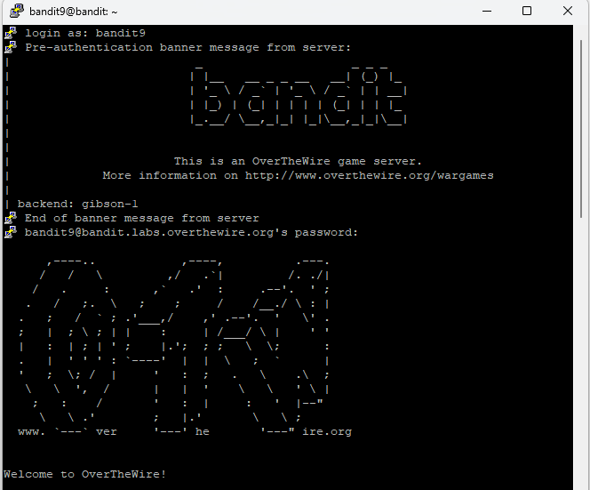
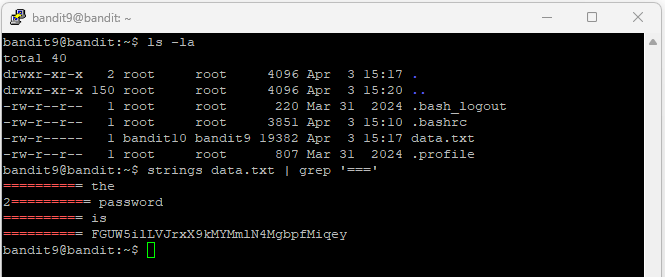

# Level 10

## Goal

Retrieve the password for Level 11 from the file `data.txt`, where the password is stored in one of the few human-readable strings preceded by several `=` characters.

---

## Access

The connection was established using SSH with the credentials obtained from Level 9.

For SSH setup instructions, refer to the [PuTTY Setup Guide](../Setup/PuTTY-Setup/README.md).

---

## Credentials

### Username

```text
bandit9
```

### Password

```text
4CKMh1JI91bUIZZPXDqGanal4xvAg0JM
```

---

## Commands Used

### Command 1 — List Files and Directories Using `ls -la`

```bash
ls -la
```

Lists all files and directories, including hidden files, along with detailed file permissions and ownership information.

### Command 2 — Extract Human-Readable Strings Using `strings` and Search with `grep`

```bash
strings data.txt | grep '===='
```

Extracts readable text from the file and searches for lines containing multiple `=` characters.

---

## Explanation

The `ls -la` command was used to identify the `data.txt` file in the home directory.

The `strings data.txt | grep '===='` command was used to locate the password hidden among readable strings.

- `strings data.txt` extracts human-readable text from a binary file
- `|` passes the output of one command to another command
- `grep '===='` searches for lines containing several `=` characters

The output displayed several lines, and the password appeared after a sequence of `=` characters.

The `strings` command extracted the readable text from the file, and the `grep` command located the line containing the password for Level 11.

---

## Retrieved Password

```text
FGUW5ilLVJrxX9kMYMmlN4MgbpfMiqey
```

---

## Screenshots

### SSH Login



### Password Retrieval Using `strings` and `grep`



---

## Key Learning

- Using the `strings` command to extract readable text from files
- Searching output with `grep`
- Combining commands using pipes (`|`)
- Working with binary files in Linux
- Identifying hidden information within file contents
