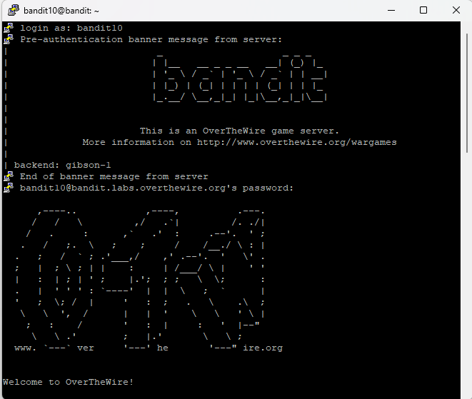
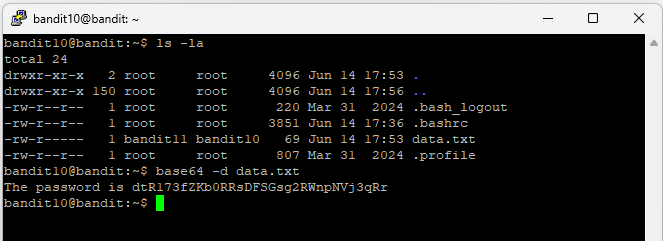

# Level 11

## Goal

Retrieve the password for Level 12 from the file `data.txt`, which contains Base64 encoded data.

---

## Access

The connection was established using SSH with the credentials obtained from Level 10.

For SSH setup instructions, refer to the [PuTTY Setup Guide](../Setup/PuTTY-Setup/README.md).

---

## Credentials

### Username

```text
bandit10
```

### Password

```text
FGUW5ilLVJrxX9kMYMmlN4MgbpfMiqey
```

---

## Commands Used

### Command 1 — List Files and Directories Using `ls -la`

```bash
ls -la
```

Lists all files and directories, including hidden files, along with detailed file permissions and ownership information.

### Command 2 — Decode Base64 Data Using `base64`

```bash
base64 -d data.txt
```

Decodes the Base64-encoded contents of `data.txt`.

---

## Explanation

The `ls -la` command was used to identify the `data.txt` file in the home directory.

The `base64 -d data.txt` command was used to decode the Base64-encoded contents of the file.

- `base64` is a utility used to encode and decode Base64 data
- `-d` tells the command to decode the input
- `data.txt` contains the encoded data

The command displayed the decoded contents of the file and revealed the password for Level 12.

---

## Retrieved Password

```text
dtR173fZKb0RRsDFSGsg2RWnpNVj3qRr
```

---

## Screenshots

### SSH Login



### Base64 Decoding and Password Retrieval



---

## Key Learning

- Understanding Base64 encoding and decoding
- Using the `base64` command in Linux
- Decoding encoded file contents
- Working with encoded data formats
- Reading and interpreting command output
