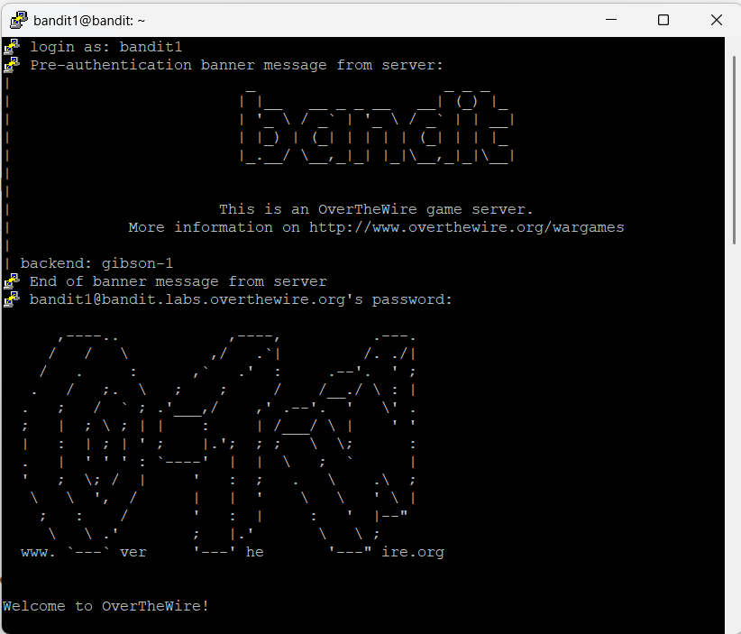
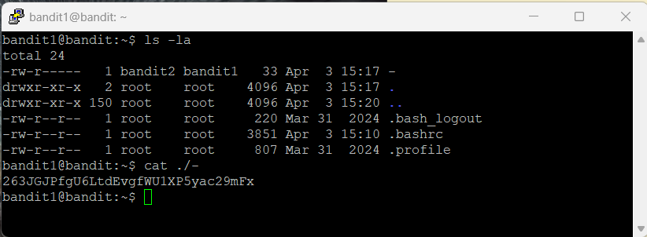

# Level 1

## Goal

Retrieve the password for Level 2 from the file named `-` located in the home directory.

---

## Access

The connection was established using SSH with the credentials obtained from Level 0.

For SSH setup instructions, refer to the [PuTTY Setup Guide](../Setup/PuTTY-Setup/README.md).

---

## Credentials

### Username

```text
bandit1
```

### Password

```text
ZjLjTmM6FvvyRnrb2rfNWOZOTa6ip5If
```

---

## Commands Used

### Command 1 — List Files and Directories Using `ls -la`

```bash
ls -la
```

### Command 2 — Read File Contents Using `cat`

```bash
cat ./-
```

---

## Explanation

The `ls -la` command was used to identify the file named `-` in the home directory.

The `cat ./-` command was used to read the contents of the file named `-`.

The `./` prefix is required because the `-` character is normally interpreted as standard input/output by Linux commands.

---

## Retrieved Password

```text
263JGJPfgU6LtdEvgfWU1XP5yac29mFx
```

---

## Screenshots

### SSH Login



### Password Retrieval from `-`



---

## Key Learning

- Understanding special filenames in Linux
- Reading files with special characters
- Using relative paths
- Handling command-line parsing behavior
