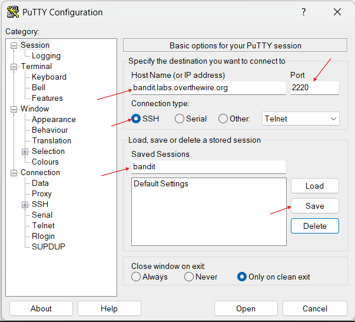
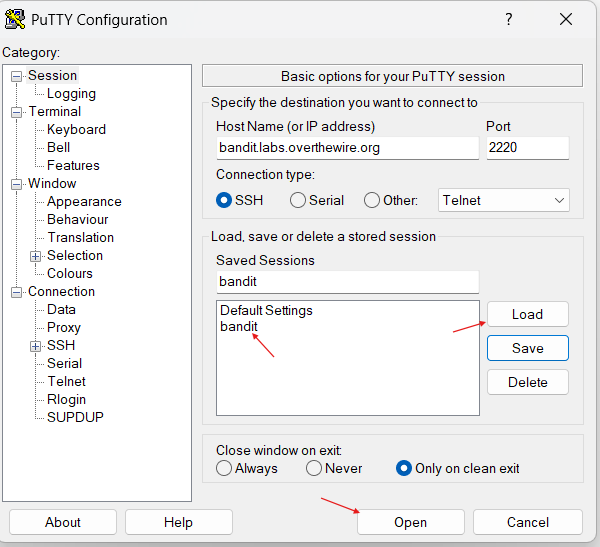
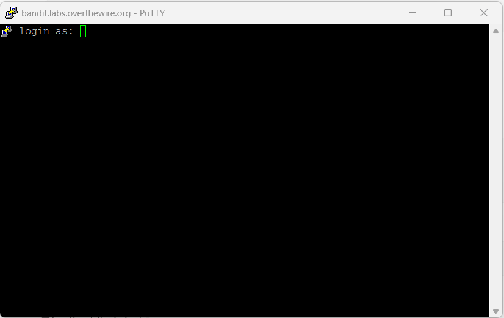

# PuTTY SSH Setup for OverTheWire Bandit

This guide explains how to connect to the OverTheWire Bandit server using PuTTY on Windows.

---

## Requirements

- Windows Operating System
- Internet Connection
- PuTTY SSH Client

---

## Download PuTTY

Official Website: [PuTTY](https://www.putty.org/)

---

## Why Use PuTTY

PuTTY is a lightweight SSH client commonly used on Windows systems to connect to remote Linux servers securely.

---

## PuTTY Configuration

### 1. Enter Host Name

In the `Host Name` field, enter:

```text
bandit.labs.overthewire.org
```

### 2. Enter Port Number

In the `Port` field, enter:

```text
2220
```

### 3. Select Connection Type

Choose:

```text
SSH
```

### 4. Save the Session

1. Locate the `Saved Sessions` field
2. Enter a session name such as:

```text
bandit
```

3. Click `Save`

This allows quick reconnection later.

### 5. Connect to the Server

1. Select the saved session from the list
2. Click `Load`
3. Click `Open`

### 6. Login to the Server

When the terminal window opens:

1. Enter the username for the current Bandit level
2. Enter the corresponding password
3. Press `Enter`

Example for Level 0:

```text
Username: bandit0
Password: bandit0
```

---

## Screenshots

### PuTTY Configuration



### Load Saved Session



### Login Screen



---

## Key Learning

- Understanding SSH connections
- Using PuTTY on Windows
- Saving SSH sessions
- Connecting to remote Linux systems

---

## Notes

The SSH configuration remains the same for all Bandit levels. Only the username and password change between levels.
